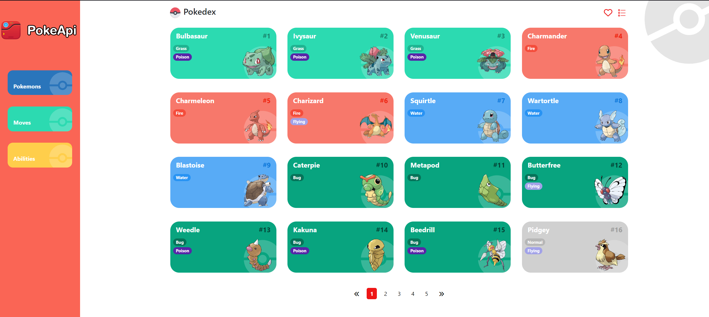
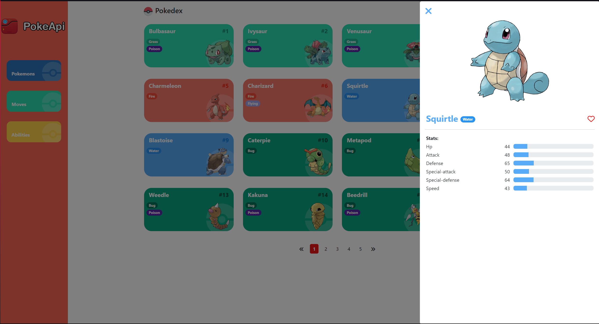

# <Project Pokedex>

<Brief Page to see pokemons>

## Table of Contents
- [Preview](#preview)
- [Getting Started](#getting-started)
  - [Prerequisites](#prerequisites)
  - [Installation](#installation)
- [Libraries Used](#libraries-used)
- [Running the App](#running-the-app)
  - [Development Server](#development-server)
  - [Build](#build)
  - [Docker](#docker)


## Preview
<div style="display: flex; justify-content: space-between"> 
   
   
</div>

## Getting Started
This section will guide you through the process of setting up the Angular Pokédex app on your local environment. By following these steps, you'll have a running instance of the app, which utilizes the public PokeAPI to fetch and display Pokémon data.

### Prerequisites
- [Node.js](https://nodejs.org/) (v18.13 or higher)
- [npm](https://www.npmjs.com/) (include)
- [Angular CLI](https://angular.io/cli) (v17.0.0 or higher)

You can check the versions of Node.js and npm by running the following commands in your terminal:

```bash
node --version
npm --version
```

### Installation
1. Clone the repository
```bash
git clone https://github.com/MarcosPD3008/pokedex
```

2. Navigate to the project directory
```bash
cd pokedex
```

3. Install the project dependencies
```bash
npm install
```

## Libraries Used
- [Bootstrap](https://getbootstrap.com/)
- [Font Awesome](https://fontawesome.com/)


## Running the App
### Development Server
To run the app on a development server, execute the following command:
```bash
ng serve --open
```

### Build
To build the app for production, execute the following command:
```bash
ng build
```

### Docker

Using Docker to run the Angular Pokédex app provides a seamless way to ensure that the app runs the same way in any environment. Docker containers package up the code and all its dependencies so the application runs quickly and reliably from one computing environment to another. Below are the steps to build and run your app inside a Docker container.

#### Building the Docker Image

Before running the app in a Docker container, you need to build a Docker image. A Docker image is a lightweight, standalone, executable package that includes everything needed to run a piece of software, including the code, a runtime, libraries, environment variables, and config files.

To build the Docker image for the Pokédex app, execute the following command in your terminal:

```bash
docker build -t pokedex .
```

#### Running the Docker Container

After building the Docker image, you can run the Pokédex app inside a Docker container. To do this, execute the following command:

```bash
docker run -d -p 8080:80 pokedex
```
